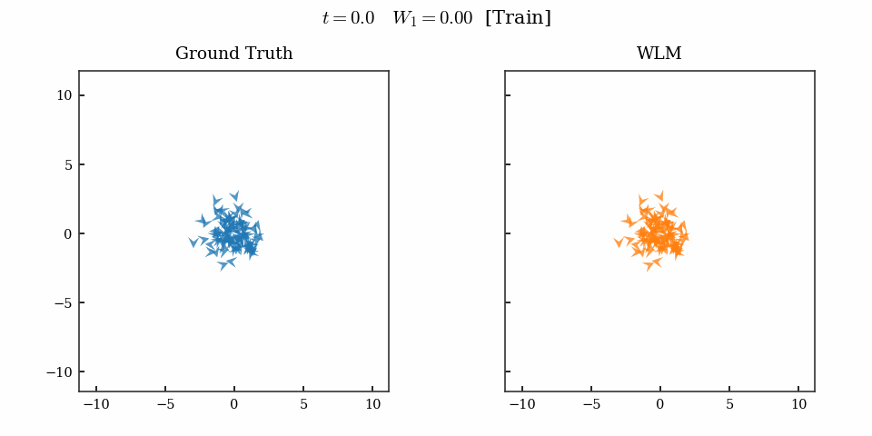

# Wasserstein Lagrangian Mechanics

Code for **A Call to Lagrangian Action: Learning Population Mechanics from Population Snapshots**.

`WLM` learns population dynamics by parameterising a potential energy functional and rolling out the induced second-order mechanics (with optional learnable friction) under the damped Wasserstein–Lagrangian principle of least action. The learned dynamics can be simulated from any time point in order to interpolate or forecast unseen marginals. An example is visualized below for a population of 100 Boids:

<p align="center">
  
</p>

## Try it in Colab

The fastest way to see `WLM` in action is the [Boids notebook](https://colab.research.google.com/drive/1R4q5pysHaYOMIu77vT6JID7yCLYG3t4z?usp=sharing). It generates the Boids dynamics shown in the GIF above, trains a small `WLM` model on the first half of the animation, and tests both forecasting and generalization to unseen initial distributions. The notebook should run in about 10 minutes (on both CPU and GPU).

## Installation

```bash
git clone https://github.com/guanton/WLM.git
cd WLM

# Environment (conda also works in place of micromamba)
micromamba env create -f env.yaml
micromamba activate WLM
```

The default `env.yaml` installs PyTorch with CUDA 12.1. For CPU-only, swap `pytorch-cuda=12.1` for `cpuonly` (under the `pytorch` channel) before creating the env.

## Datasets

Three datasets are included under `datasets/`:

| File | Source |
|---|---|
| `datasets/oceans_with_v0.npz` | small Gulf-of-Mexico vortex (HYCOM); preprocessed as in [curly-flow-matching](https://github.com/kpetrovicc/curly-flow-matching) |
| `datasets/big_oceans_forecast.npz` | big Gulf-of-Mexico vortex (HYCOM); preprocessed as in [Berlinghieri et al. 2025](https://arxiv.org/abs/2501.13123) |
| `datasets/eb_velocity_v5.npz` | embryoid body single-cell RNA + RNA velocity ([Moon et al. 2019](https://www.nature.com/articles/s41587-019-0336-3)), preprocessed as in [Tong et al. 2020](https://arxiv.org/abs/2002.04461) |

Boids and gradient-flow SDE data are generated synthetically by `data_generator.py`.

## Running an experiment from the command line

Each experiment is split into a **data config** (under `configs/data/`) and a **model config** (under `configs/models/`). The wrapper script `scripts/run_from_configs.sh` chains data them, sharing one bundle across runs that point at the same data config.

```bash
# Single run — boids forecast, seed 0
bash scripts/run_from_configs.sh \
    boids_demo \
    configs/data/boids.yaml \
    configs/models/boids.yaml \
    repro \
    0
```

This writes:

```
runs/boids_demo/data/boids_seed0/bundle.pt              # generated data
runs/boids_demo/train/repro_seed0/                      # checkpoints, metrics, gifs
```

Override anything from the YAML on the command line with `--set key=value`:

```bash
bash scripts/run_from_configs.sh boids_demo \
    configs/data/boids.yaml configs/models/boids.yaml \
    short_run 0 \
    --set num_epochs=2000
```

Set `DEVICE=cpu` (env var) to run on CPU. W&B is on by default; pass `WANDB_ON=0` to disable.

## Reproducing the paper experiments

We provide TSV runlists under `runlists/` covering the main paper experiments. Each row is one run (one master tag, one data config, one model config, one run name, one seed, plus per-row overrides).

### With SLURM

```bash
RUNS_DIR=eb                 sbatch --array=0-14 scripts/sbatch_run.sbatch runlists/eb.tsv
RUNS_DIR=oceans_interpolate sbatch --array=0-2  scripts/sbatch_run.sbatch runlists/oceans_interpolate.tsv
RUNS_DIR=oceans_forecast    sbatch --array=0-2  scripts/sbatch_run.sbatch runlists/oceans_forecast.tsv
RUNS_DIR=gf_sde             sbatch --array=0-19 scripts/sbatch_run.sbatch runlists/gf_sde.tsv
RUNS_DIR=boids              sbatch --array=0-0  scripts/sbatch_run.sbatch runlists/boids.tsv
```

`sbatch_run.sbatch` defaults to running from the current working directory and activating an env named `WLM`. Override with `WLM_REPO=/path/to/repo WLM_ENV=myenv sbatch ...` if your layout differs.

### Without SLURM (any machine, including CPU-only)

The runlists are plain TSVs — pick any row and pass its fields straight to `run_from_configs.sh`. For example, to reproduce row 0 of `eb.tsv` on CPU:

```bash
DEVICE=cpu bash scripts/run_from_configs.sh \
    eb configs/data/eb.yaml configs/models/eb.yaml h1_s0 0 \
    --holdout-marginals 1 --set particles_per_batch=1024
```
